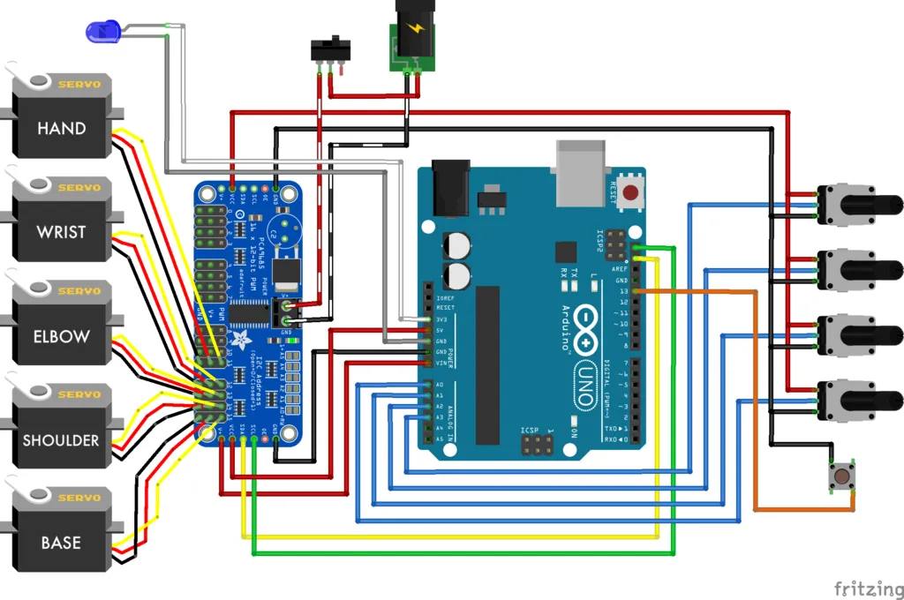

# AI-Assisted Teleoperated Robotic Arm

An AI-enhanced, 3D-printed master-slave robotic arm system integrated with a computer vision pipeline for real-time object tracking and automated precision grasping. 

---

## 🚀 Features

* **Master-Slave Control System:** Real-time teleoperation using an external controller arm. Synchronous movement is achieved by reading analog inputs from potentiometers to actuate high-torque servo motors.
* **AI Computer Vision Pipeline:** Integrated camera module powered by **PyTorch** and **OpenCV** to detect, classify, and track target objects in real-time.
* **Automated Grasping Algorithm:** An intelligent control override that fine-tunes the claw's final trajectory and alignment for an optimal grip, reducing manual targeting errors by **40%**.
* **Optimized 3D-Printed Design:** Full mechanical structure optimized for joint kinematics, structural integrity, and smooth, responsive movement replication.

---

## 🛠️ Hardware & Components

* **Microcontroller:** Arduino Uno (Master-Slave synchronization)
* **Actuators:** 20KG High-Torque Servos & MG90S/SG90 Micro Servos
* **Drivers:** PCA9685 16-Channel 12-bit PWM Servo Driver
* **Inputs:** Rotary Potentiometers (for the controller arm) & Camera Module (for AI vision)
* **Power:** Adjustable Power Supply with dedicated Power Switches
* **Structure:** 3D Printed PLA components (Kinematics-optimized chassis & gripper gears)

---

## 💻 Tech Stack

* **Hardware Programming:** Arduino (C/C++)
* **AI & Computer Vision:** Python, PyTorch, OpenCV
* **Design & Modeling:** CAD (Fusion 360 / SolidWorks) for mechanical adjustments

---

## 📂 Repository Structure

* `Compact_Robot_Arm_Code.ino` - Core Arduino firmware managing the master-slave servo mappings and potentiometer telemetry.
* `README.md` - Documentation of the project.

